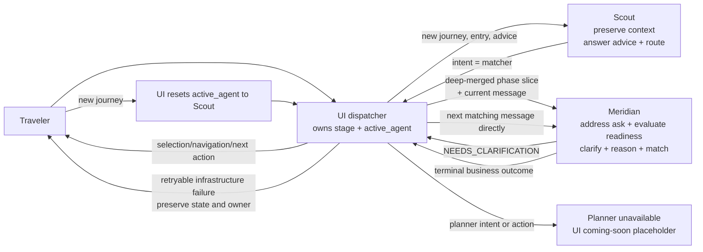

# TWM Architecture

This document describes the general architecture. It is intentionally platform-agnostic. It has a small set of stable contracts and several swappable implementation choices.

## Design Philosophy

TWM features are independent product surfaces connected by UI-owned lifecycle state.

Trip Matcher and Trip Planner do not call each other. The UI is the product-level dispatcher: it owns lifecycle sequence, the active conversational owner, persistence, and navigation.

The user decides how far they go:

```text
- they can match and leave
- they can plan without ever matching
- they can go back and forth freely while status is free
- sequencing lives in the UI and the user's intent, not in feature coupling
```

What connects the product is shared state and UI-owned phase routing: [TripState](TRIP_STATE.md).

## Conversation Ownership and Dispatch



Scout is invoked only while Scout owns the conversation. It preserves each useful extracted value verbatim under a semantic key and answers general advice without performing recommendation work. After handoff, Meridian addresses the current matching ask from known context, asks one material clarification only when required, recommends after the answer when ready, and owns constraint accounting, feasibility, and refinement. A terminal Meridian outcome returns lifecycle control to the UI; it does not route the completed turn back through Scout.

Each feature:

```text
1. reads relevant TripState sections when opened
2. does its job
3. writes back only the fields it owns or produces
```

The user experience feels connected because TripState travels across phases.

```text
        TripState
   localStorage -> DB
       ^     ^      ^
       |     |      |
  Matcher Planner Future features
```

This is different from the internal workflow/agent engine used inside a feature. A feature may use n8n, LangGraph, custom orchestration, or another engine internally, but features should remain independent from each other.

## Fixed Parts

These are the parts that should remain stable as the system evolves.

### 1. APIs

The UI should only need the backend base URL, not n8n or any other workflow engine.

Endpoint shape:

Examples:
```text
{base_url}/scout
{base_url}/meridian
```

**Trip Matcher**

[Trip Matcher API contracts](trip-matcher/API_CONTRACTS.md).

**Trip Planner**

PLACEHOLDER

### 2. TripState

[TripState](TRIP_STATE.md) is the shared object that connects phases.

Current storage:

```text
localStorage
```

Future storage:

```text
database
```

The storage layer can change without changing the core state model.

### 3. KB Schema

PLACEHOLDER

## Feature Boundaries

### Scout / Trip Matcher

Scout is the conversational entry point for a new journey and for Scout-owned advice. It extracts raw trip context and returns a handoff intent. Matcher turns are handed to Meridian, which owns the visible matching conversation until a terminal outcome.

Details live in [Trip Matcher](trip-matcher/README.md), [Scout](trip-matcher/SCOUT.md), and [Meridian](trip-matcher/MERIDIAN.md).

Reads:

```text
trip_context
advisor_state
```

Scout returns deltas for:

```text
trip_context
```

Scout receives `stage`, `trip_context`, and `advisor_state`, plus the current user message. It extracts specific reusable traveler signals directly under `trip_context`, preserves each value verbatim with distinctions and qualifiers that affect later decisions, returns only new or updated context fields in `state_delta`, and returns routing through top-level `intent`. It does not copy the full query into context or write lifecycle/operational state.

Meridian receives `trip_context`, the minimal read-only `advisor_state.conversation_context.last_advisor_message`, `matcher_state`, and the current traveler `message`. It addresses the current matching ask from known context, evaluates readiness without a universal field checklist, asks one material clarification when required, and recommends after the answer when ready. Its recommendation output uses `why_ranked_here` as **Why this works for you** and keeps constraints, assumptions, trade-offs, and circuit feasibility explicit. It does not receive `trip_id`, `status`, `stage`, `planner_state`, or UI-owned lifecycle fields. Meridian returns a traveler-facing matcher `message`, a business `status`, an agent-owned `state_delta`, and optional recommendation output.

Neither agent currently has curated grounding or live verification. Time-sensitive guidance must be qualified and direct the traveler to relevant current checks rather than presenting unverified claims as current facts.

```text
matcher_state.conversation_context
matcher_state.rejected_options
```

The UI owns deterministic lifecycle and history writes:

```text
stage
active_agent
selected destination / option
matcher_state.recommendations
```

For Scout advice turns, the UI also stores the top-level visible `message` in `advisor_state`, creates the advice artifact and timestamp, and preserves Scout agent provenance. Scout reads this UI-owned memory on useful follow-up or resume turns.

### Trip Planner

Trip Planner helps the user plan the trip once a destination is known.

Planner is currently represented by a UI/planner-layer coming-soon response when Scout routes a turn to `intent = planner`.

Reads:

```text
trip_context
advisor_state
```

Writes:

```text
planner_state
stage
```

Trip Planner does not read or write `matcher_state`.

Trip Planner should work whether or not Trip Matcher was used. If required planning context is missing, Planner asks the user and writes the answer to TripState.

### Future Features

Future features follow the same pattern:

```text
read relevant TripState sections
do their job
write back their owned output
```

## Swappable Parts

These can change without changing the whole product.

### Hosting Platform

Current:

```text
FastAPI on Render
n8n on AWS EC2
```

Swappable with:

```text
another VPS
AWS ECS
AWS Fargate
Render
Railway
Fly.io
Kubernetes
any Docker-capable backend server
```

The requirement is that the platform can run the backend services and expose the backend API to the UI.

### Backend API Framework

Current:

```text
FastAPI
```

Swappable with:

```text
Flask
Django
Node/Express
NestJS
Go
another HTTP API framework
```

The important part is preserving the API contract used by the UI.

### Workflow / Agent Engine

Current:

```text
n8n
```

Swappable with:

```text
LangGraph
custom Python orchestration
another workflow engine
```

Today n8n gives a visual workflow layer. Later LangGraph would make the backend lighter and more code-driven.

FastAPI talks to the current implementation through a stable `AgentEngine` interface:

```text
AgentEngine.scout(trip_state, message)
AgentEngine.meridian(trip_state, message)
```

The selected implementation is controlled by:

```env
agent_engine=n8n
```

Routes and UI contracts should not change when replacing n8n with LangGraph or custom Python orchestration. A new engine should implement the same `AgentEngine` methods and preserve the same `/scout` and `/meridian` response contracts.

### LLM Provider

Current:

```text
Groq
```

Swappable with:

```text
Anthropic
Gemini
OpenRouter
local models
another LLM provider
```

The logic should not depend on LLM. GPT, Claude, Gemini, or another capable model should be able to execute the same instructions behind the same product.

### Frontend Hosting

Current:
```text
Vercel
```

Future UI hosting may be:

```text
Netlify
Cloudflare Pages
S3 + CloudFront
another frontend host
```

The only required configuration is the backend API base URL.

### Knowledge Base
Current:

```text
GitHub YAML files
  -> ingest.py
      -> Supabase free-tier Postgres
          -> Queries via SQL filters
```

Later:

```text
SQL filtering + semantic retrieval
```

For Trip Matcher, SQL filtering is enough for the current stage. Trip Planner may later need semantic retrieval in addition to structured filters.

## Current Deployment Shape

This is what exists today:

```text
UI -> hosted on Vercel
Backend API -> hosted on Render

EC2
  -> self hosted n8n
  -> postgres for n8n only

Knowledge base
GitHub YAML files
  -> ingest.py
      -> Supabase free-tier Postgres
          -> Queries via SQL filters

The KB database does not need to run on the backend server if Supabase is used.
```

Deployment setup and backend runtime operations are documented in the `TravelWithMe` backend repository.

## Future Orchestration Layer scope

The orchestration layer is swappable. It can be:

```text
n8n
LangGraph
custom orchestration
another workflow/agent engine
```

The shape stays:

```text
UI
  -> Backend API
      -> FastAPI or another API framework
          -> AgentEngine
              -> n8n today
              -> LangGraph / custom Python later
              -> KB queries
              -> LLM
```

If the orchestration layer is code-native and runs inside the API service, the backend server can become lighter:

```text
api container only
no separate orchestration container
no local Postgres container just for orchestration persistence
```

This can be more suitable for small instances, but it is a tradeoff. n8n gives a visual workflow layer; code-native orchestration gives tighter code control and fewer runtime services.
