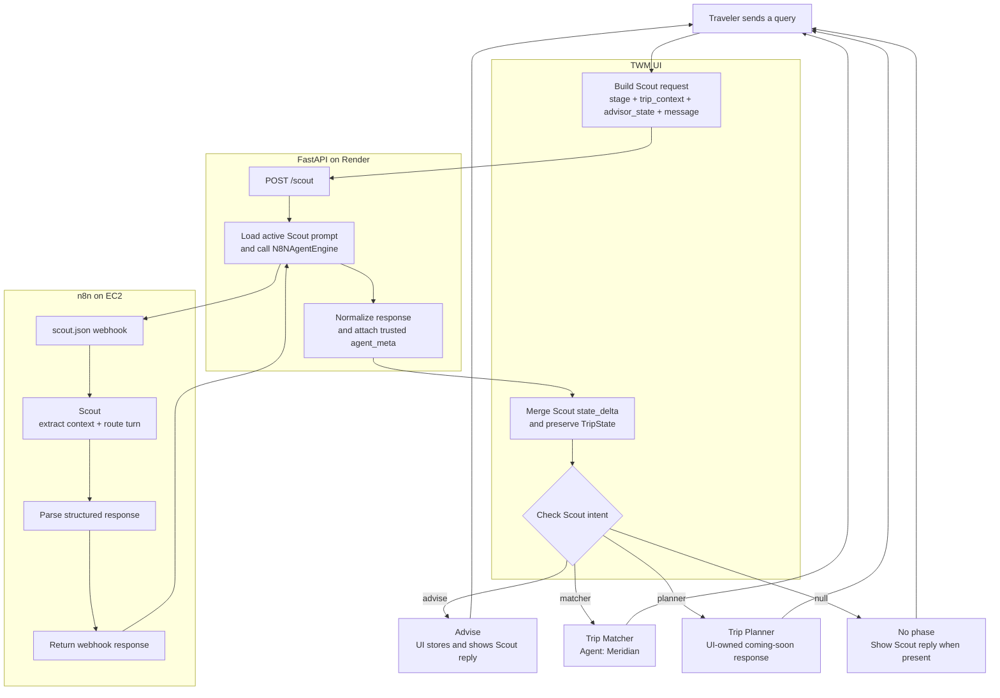

# Travel With Me

Travel With Me (TWM) uses Scout as the conversational front door for every traveler query. Scout preserves useful trip context, answers advice turns, and routes work to the appropriate product capability.

## Conversational Flow

Scout does not generate destination rankings. When Scout returns `intent = matcher`, the UI calls the Trip Matcher in the same chat turn. Meridian is the agent responsible for the matcher response.

See the [Trip Matcher flow](trip-matcher/README.md) for the complete Meridian request, execution, and response lifecycle.

## Product Documentation

- [Architecture](ARCHITECTURE.md)
- [TripState](TRIP_STATE.md)
- [Lifecycle stage transitions](STAGE_TRANSITIONS.md)
- [Trip Matcher](trip-matcher/README.md)
- [Trip Matcher API contracts](trip-matcher/API_CONTRACTS.md)
