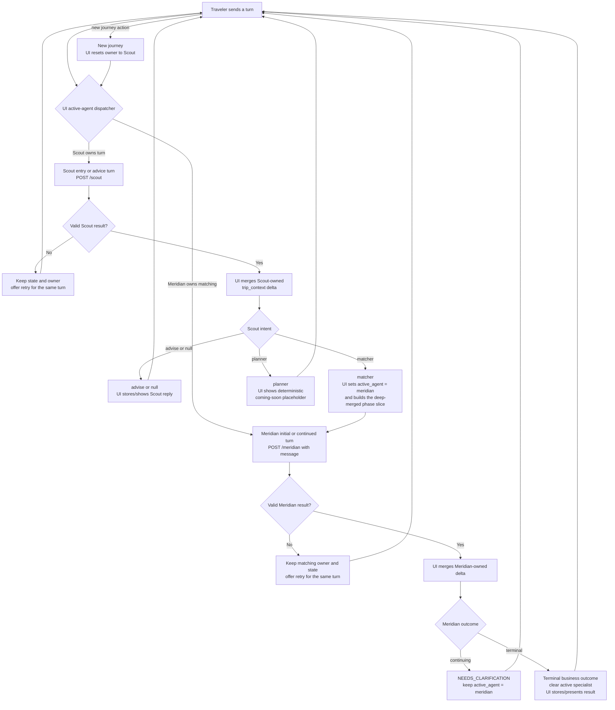
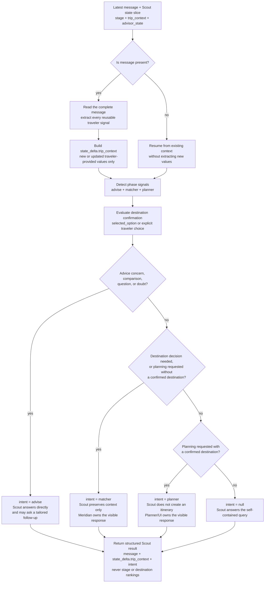

# Travel With Me

Travel With Me (TWM) uses Scout as the conversational front door for a new journey and for Scout-owned advice. After Scout hands a phase to a specialist, the UI routes later turns directly to that active specialist until the specialist returns a terminal outcome or the traveler starts a new journey.

## Conversational Flow

The UI owns `active_agent`, lifecycle `stage`, persistence, retry, selection, navigation, and recommendation history. Scout and Meridian return only their validated messages, routing or business outcome, and agent-owned deltas.

Scout does not generate destination rankings. When Scout returns `intent = matcher`, the UI first merges Scout's traveler-context delta, then calls Meridian with the updated phase slice and the same traveler message. Later matching replies go directly to Meridian without returning through Scout.

See the [Trip Matcher flow](trip-matcher/README.md) for the complete Meridian request, execution, and response lifecycle.

## Scout Internal Decision Flow

Scout extracts traveler context before deciding who should respond. It routes to the earliest unresolved phase and returns only context added or changed by the current turn.

The routing order is `advise → matcher → planner`: when a turn touches multiple phases, Scout selects the earliest phase that is still unresolved. A casually mentioned destination is not confirmation; a deterministic `trip_context.selected_option` or an explicit traveler choice is.

## Product Documentation

- [Architecture](ARCHITECTURE.md)
- [TripState](TRIP_STATE.md)
- [Lifecycle stage transitions](STAGE_TRANSITIONS.md)
- [Trip Matcher](trip-matcher/README.md)
- [Trip Matcher API contracts](trip-matcher/API_CONTRACTS.md)
