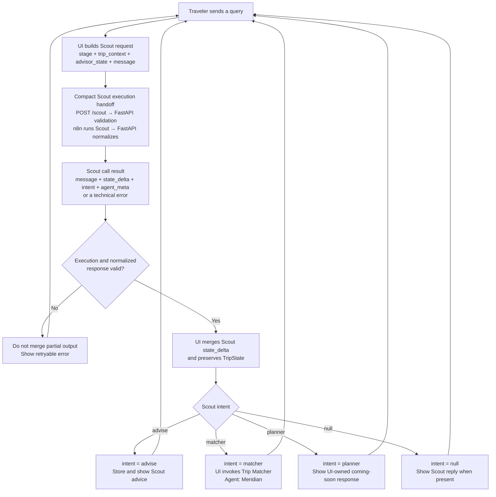
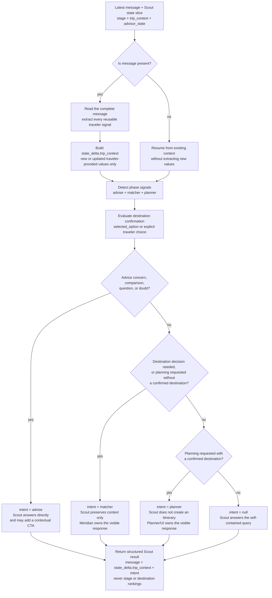

# Travel With Me

Travel With Me (TWM) uses Scout as the conversational front door for every traveler query. Scout preserves useful trip context, answers advice turns, and routes work to the appropriate product capability.

## Conversational Flow

The Scout execution handoff is intentionally compact. The primary product flow begins when the call returns: the UI preserves state, evaluates `intent`, and hands the traveler to the responsible experience.

Scout does not generate destination rankings. When Scout returns `intent = matcher`, the UI calls the Trip Matcher in the same chat turn. Meridian is the agent responsible for the matcher response.

See the [Trip Matcher flow](trip-matcher/README.md) for the complete Meridian request, execution, and response lifecycle.

## Scout Internal Decision Flow

Scout extracts traveler context before deciding who should respond. It routes to the earliest unresolved phase and returns only context added or changed by the current turn.

The routing order is `advise → matcher → planner`: when a turn touches multiple phases, Scout selects the earliest phase that is still unresolved. A casually mentioned destination is not confirmation; a deterministic `trip_context.selected_option` or an explicit traveler choice is.

## Product Documentation

- [Architecture](ARCHITECTURE.md)
- [TripState](TRIP_STATE.md)
- [Lifecycle stage transitions](STAGE_TRANSITIONS.md)
- [Trip Matcher](trip-matcher/README.md)
- [Trip Matcher API contracts](trip-matcher/API_CONTRACTS.md)
