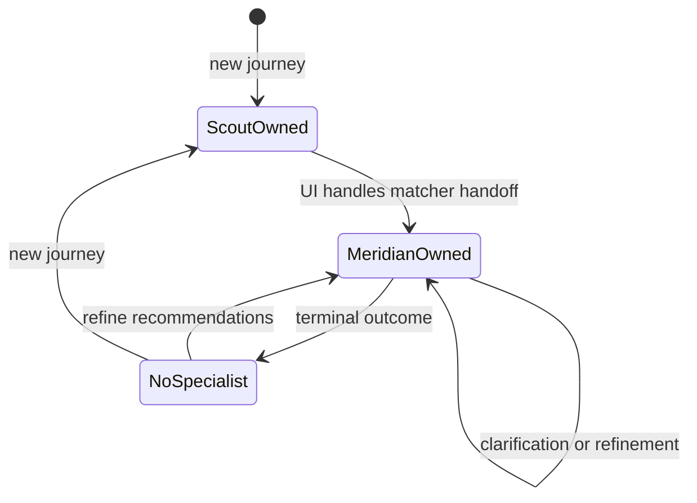

# Stage Transitions

Stages are UI-owned lifecycle state. They are separate from Scout's per-turn `intent` and from UI-owned `active_agent` routing state.

## Active-owner transitions

| Event | UI routing result |
|---|---|
| New journey | `active_agent = scout` |
| Scout returns validated `intent = matcher` | `active_agent = meridian` |
| Meridian returns `NEEDS_CLARIFICATION` | Keep `active_agent = meridian` |
| Meridian returns a terminal business status | Clear `active_agent` |
| Retryable infrastructure failure | Preserve the current `active_agent` and valid state |
| Traveler refines a terminal recommendation | `active_agent = meridian` |

## Forward Transitions

| From Stage | To Stage | Trigger |
|---|---|---|
| `new` | `matching` | UI handles Scout's validated Matcher handoff |
| `matching` | `matching` | Meridian asks a soft clarification with `NEEDS_CLARIFICATION` |
| `matching` | `recommended` | Meridian returns recommendation or matcher business output |
| `recommended` | `matched` | User selects or clearly confirms one destination/circuit |
| `matched` | `planning` | UI handles a validated Planner route or planning action |
| `planning` | `planned` | Planner completes a plan |

## Backward Transitions

| From Stage | To Stage | Trigger |
|---|---|---|
| `recommended` | `matching` | User rejects recommendations or asks to refine preferences |
| `matched` | `recommended` | User rejects selected destination but wants to choose from existing recommendations |
| `matched` | `matching` | User rejects selected destination and wants fresh recommendations |
| `planning` | `matched` | User changes itinerary details but keeps the same destination |
| `planning` | `recommended` | User changes destination from existing recommendations |
| `planning` | `matching` | User changes destination, budget, dates, duration, or trip goal significantly |

`recommendation_ready` remains a supported stored stage but is not part of the primary handoff path.

Agents never write `stage` or `active_agent`; the UI derives both from validated handoff signals, specialist outcomes, and traveler actions.
