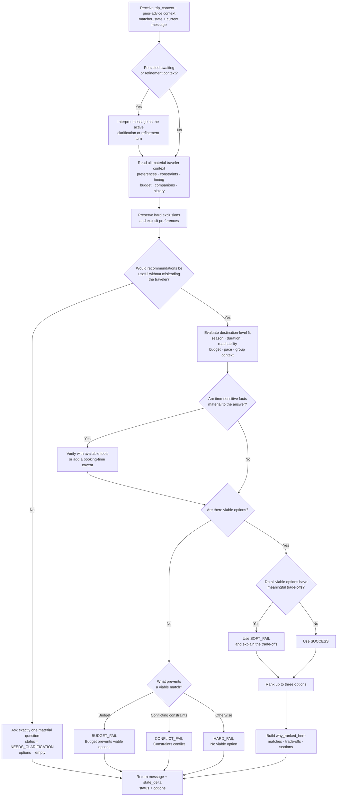

# Meridian

Meridian is the conversational Trip Matcher.

Scout extracts traveler context and performs the initial matcher handoff. Meridian then owns the visible matching conversation: it may ask one useful clarification, continue from the traveler's answer, refine prior recommendations, or return a terminal destination/circuit outcome.

Meridian is stateless. It receives the current payload and returns one response.

---

## Responsibility

```text
- interpret open-ended trip_context
- decide whether destination-level recommendations can be useful now
- ask at most one soft clarification when needed
- generate destination/circuit options when useful
- return a traveler-facing message
- return state_delta so the UI can deep-merge matcher context
- preserve UI-compatible recommendation payloads
```

Scout handles advice and routing. Meridian handles matcher conversation and recommendation reasoning. Planner handles itinerary execution.

---

## Input

Meridian receives:

```json
{
  "trip_state": {
    "trip_context": {},
    "advisor_state": {
      "conversation_context": {
        "last_advisor_message": "string | null"
      }
    },
    "matcher_state": {
      "conversation_context": {
        "last_meridian_message": "string | null",
        "awaiting": "string | null"
      },
      "recommendations": [],
      "rejected_options": []
    }
  },
  "message": "string | null"
}
```

`trip_state` is Meridian's phase slice. It is not the full application TripState and does not include lifecycle fields, `stage`, `active_agent`, or `planner_state`.

`advisor_state.conversation_context.last_advisor_message` is minimal read-only handoff context. `message` is the current traveler turn: the initial matcher-triggering turn or a later clarification/refinement sent directly by the UI.

Meridian reads the open-ended fields in `trip_state.trip_context` as traveler facts, constraints, preferences, timing, budget, companions, travel history, and other useful context. `selected_option`, when present, is deterministic selection context.

The matcher reads whatever Scout preserved, including arrays and nested objects. Traveler wording is treated as evidence and should not be normalized unless Meridian needs an internal interpretation.

Meridian reads `trip_state.matcher_state` for matcher continuity: previous recommendations, rejected options, and the current matcher clarification state.

---

## Internal Decision Flow



The flow is destination-level only. Meridian does not create an itinerary, write lifecycle `stage`, or select an option on the traveler's behalf. When the response reaches the UI, the UI owns lifecycle transitions, recommendation storage, and deterministic selection.

---

## Output Contract

Meridian always returns valid JSON:

```json
{
  "message": "traveler-facing matcher reply",
  "state_delta": {
    "trip_context": {},
    "matcher_state": {
      "conversation_context": {
        "last_meridian_message": "same text as message",
        "awaiting": "string | null"
      }
    }
  },
  "status": "NEEDS_CLARIFICATION | SUCCESS | SOFT_FAIL | HARD_FAIL | BUDGET_FAIL | CONFLICT_FAIL",
  "generated_at": "ISO-8601 timestamp",
  "trip_type": "single | circuit | mixed | null",
  "options": []
}
```

For supported failure outcomes, Meridian may additionally return non-empty `constraint_adjustment_suggestions`. The field is omitted for `SUCCESS`, `NEEDS_CLARIFICATION`, and whenever no useful adjustment exists. It is never returned as `null`.

Meridian must not return:

```text
recommendation_intent
stage
MISSING_INPUTS
```

The UI owns lifecycle stages and deterministic selection.

The core response contract intentionally contains only fields the UI/orchestration uses. Extra internal reasoning should stay inside Meridian unless the UI has a product use for it.

---

## Clarification

Use `NEEDS_CLARIFICATION` only when one missing answer would materially change the destination-level recommendation.

Rules:

```text
- ask exactly one concise question
- keep options empty
- set conversation_context.awaiting to the one missing decision
- do not block merely because a form-like field is absent
```

Missing origin, exact budget, or exact duration should not automatically block recommendations if the traveler gave enough direction.

---

## Recommendation Mode

When recommendations are possible, Meridian returns:

```text
status = SUCCESS, SOFT_FAIL, HARD_FAIL, BUDGET_FAIL, or CONFLICT_FAIL
message = natural chat response
options = up to three recommendation options when viable
state_delta = only new matcher-derived context
```

Options keep the UI-compatible shape:

```json
{
  "rank": 1,
  "type": "single | circuit",
  "name": "Destination or circuit name",
  "destination_id": "stable_destination_id_or_null",
  "circuit_id": "stable_circuit_id_or_null",
  "best_for": "who this option is best for / why this rank makes sense",
  "why_ranked_here": ["string"],
  "decision_summary": {
    "matches": ["string"],
    "tradeoffs": ["string"]
  },
  "sections": [
    {
      "type": "reachability | season | budget | pace | route | stay | other",
      "heading": "string",
      "points": ["string"]
    }
  ]
}
```

The chat `message` should be a concise shortlist summary, not a duplicate of the option cards. The structured `options` let the UI render review cards and selection controls.

`why_ranked_here` is required for every option. It explains why this option has this rank, not just why the destination is generally good.

Build `why_ranked_here`, `decision_summary.matches`, and `decision_summary.tradeoffs` from material `trip_context` fields such as duration, travel month/season, budget, origin/reachability, companions/group type, crowd preference, and weather preference. Every useful field Meridian receives should be considered somewhere in ranking, matches, tradeoffs, sections, or option reasoning.

For the same query, content depth and practical fit can appear separately. For example, "enough attractions to comfortably spend 3-4 days exploring" explains whether the destination has enough to do, while "3-4 day trip fit" explains pacing and logistics. Month/season fit should be explicit when the travel month materially changes the answer.

Do not return `match_sections`, `why_this_works_for_you`, `final_recommendation`, or `refinement_hooks` in the current contract.

---

## Matching Principles

```text
explicit traveler preference > system defaults > fallback heuristics
```

Hard exclusions are absolute.

Budget, season, crowd, weather, trip purpose, travel history, and current concerns should be interpreted from the open context rather than forced into required fields.

If live facts matter, such as current closures, visa rules, weather disruption, or transport prices, Meridian should verify with available tools or caveat that the fact needs checking closer to booking.

Meridian should not fabricate current data.

---

## Stage Ownership

Meridian does not write `stage`.

While the status is `NEEDS_CLARIFICATION`, the UI keeps `active_agent = meridian` and sends the next matching turn directly to Meridian. For every terminal business status, the UI clears the active specialist and decides the next screen or action.

UI stage handling:

```text
Scout intent matcher      -> matching
Meridian NEEDS_CLARIFICATION -> matching
Meridian recommendation output -> recommended
Traveler selects option   -> matched
Planner route             -> planning
Planner finished          -> planned
```

Legacy `recommendation_ready` is no longer part of the primary flow.
