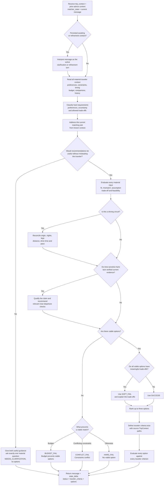

# Meridian

Meridian is the conversational Trip Matcher.

Scout extracts traveler context and performs the initial matcher handoff. Meridian then owns the visible matching conversation: it addresses the current matching ask, evaluates readiness, may ask one material clarification, recommends after the answer when ready, refines prior recommendations, and returns a terminal destination/circuit outcome.

Meridian is stateless. It receives the current payload and returns one response.

---

## Responsibility

```text
- interpret open-ended trip_context
- classify hard requirements, preferences, uncertainty, and allowed trade-offs
- address the current matching ask using the context already known
- decide whether the requested recommendation can be useful without a material assumption
- ask exactly one material clarification when needed
- generate destination/circuit options immediately when ready, including after a clarification answer
- account for every material traveler input and disclose mismatches
- keep route and circuit feasibility internally consistent
- return a traveler-facing message
- return state_delta so the UI can deep-merge matcher context
- preserve UI-compatible recommendation payloads
```

Scout handles advice and routing. Meridian handles matcher conversation and recommendation reasoning. Planner handles itinerary execution.

---

## Input

Meridian receives:

```json
{
  "trip_state": {
    "trip_context": {},
    "advisor_state": {
      "conversation_context": {
        "last_advisor_message": "string | null"
      }
    },
    "matcher_state": {
      "conversation_context": {
        "last_meridian_message": "string | null",
        "awaiting": "string | null"
      },
      "recommendations": [],
      "rejected_options": []
    }
  },
  "message": "string | null"
}
```

`trip_state` is Meridian's phase slice. It is not the full application TripState and does not include lifecycle fields, `stage`, `active_agent`, or `planner_state`.

`advisor_state.conversation_context.last_advisor_message` is minimal read-only handoff context. `message` is the current traveler turn: the initial matcher-triggering turn or a later clarification/refinement sent directly by the UI.

Meridian reads the open-ended fields in `trip_state.trip_context` as traveler facts, constraints, preferences, timing, budget, companions, travel history, and other useful context. `selected_option`, when present, is deterministic selection context.

The matcher reads whatever Scout preserved, including arrays and nested objects. Traveler wording is evidence: hard requirements remain hard, preferences may be traded off only when disclosed, and uncertainty or relative language remains qualified.

Meridian reads `trip_state.matcher_state` for matcher continuity: previous recommendations, rejected options, and the current matcher clarification state.

---

## Internal Decision Flow



The flow is destination-level only. Meridian does not create an itinerary, write lifecycle `stage`, or select an option on the traveler's behalf. When the response reaches the UI, the UI owns lifecycle transitions, recommendation storage, and deterministic selection.

---

## Output Contract

Meridian always returns valid JSON:

```json
{
  "message": "traveler-facing matcher reply",
  "state_delta": {
    "trip_context": {},
    "matcher_state": {
      "conversation_context": {
        "last_meridian_message": "same text as message",
        "awaiting": "string | null"
      }
    }
  },
  "status": "NEEDS_CLARIFICATION | SUCCESS | SOFT_FAIL | HARD_FAIL | BUDGET_FAIL | CONFLICT_FAIL",
  "generated_at": "ISO-8601 timestamp",
  "trip_type": "single | circuit | mixed | null",
  "options": []
}
```

For supported failure outcomes, Meridian may additionally return non-empty `constraint_adjustment_suggestions`. The field is omitted for `SUCCESS`, `NEEDS_CLARIFICATION`, and whenever no useful adjustment exists. It is never returned as `null`.

Meridian must not return:

```text
recommendation_intent
stage
MISSING_INPUTS
```

The UI owns lifecycle stages and deterministic selection.

The core response contract intentionally contains only fields the UI/orchestration uses. Extra internal reasoning should stay inside Meridian unless the UI has a product use for it.

---

## Clarification

Address the traveler's current matching ask using the context already known, then evaluate readiness for the recommendation type requested; there is no universal required-field checklist. Use `NEEDS_CLARIFICATION` only when one missing or ambiguous answer would materially change feasibility, ranking, or the recommendation itself.

Rules:

```text
- give brief useful guidance from the known context
- ask exactly one concise, targeted question
- keep options empty
- set conversation_context.awaiting to the one missing decision
- do not block merely because a form-like field is absent
- do not repeat a question whose answer is already available
- after an awaited answer, preserve the useful context and recommend when ready
```

Missing origin, exact budget, or exact duration should not automatically block recommendations if the traveler gave enough direction. Conversely, Meridian must not silently assume a missing origin, starting point, budget boundary, or other fact when that fact materially affects the requested recommendation.

---

## Recommendation Mode

When recommendations are possible, Meridian returns:

```text
status = SUCCESS, SOFT_FAIL, HARD_FAIL, BUDGET_FAIL, or CONFLICT_FAIL
message = natural chat response
options = up to three recommendation options when viable
state_delta = only new matcher-derived context
```

The recommendation response defines each material ask once in top-level `traveler_criteria`. Every option then references and evaluates every criterion:

```json
{
  "traveler_criteria": [
    {
      "id": "criterion_id",
      "label": "Traveler-facing criterion label",
      "requirement_type": "HARD | PREFERENCE",
      "source_context_paths": ["travel_month"]
    }
  ],
  "options": [
    {
      "rank": 1,
      "type": "single",
      "name": "Destination name",
      "destination_id": "stable_destination_id",
      "circuit_id": null,
      "summary": "Concise option-level orientation",
      "evaluations": [
        {
          "criterion_id": "criterion_id",
          "outcome": "MATCH | TRADEOFF | MISMATCH",
          "conclusion": "What this option means for this criterion",
          "details": [
            { "type": "bullets", "items": ["Supporting evidence"] }
          ],
          "tradeoffs": []
        }
      ],
      "other_considerations": []
    }
  ]
}
```

The chat `message` introduces the ranking without duplicating the cards. An option `summary` briefly orients the traveler. Each evaluation `conclusion` states the option-specific answer for one criterion. Its `details` provide approved evidence as `bullets`, `facts`, or `cost_breakdown`. A `TRADEOFF` or `MISMATCH` keeps its practical costs in that evaluation's `tradeoffs`; residual facts that do not map to one criterion belong in `other_considerations`.

Every material traveler input maps to one criterion with one or more `source_context_paths`. Criterion IDs and labels are unique, and one source path cannot belong to multiple criteria. Every option evaluates the same complete criterion set exactly once, so the UI can compare options without fixed report sections. `HARD` criteria cannot be silently relaxed or evaluated as `MISMATCH`. When the traveler is already considering options, the criteria reflect the decision factors in that ask.

`MATCH` has no trade-offs. `TRADEOFF` and `MISMATCH` require at least one trade-off. Missing cost data is omitted, never represented by zero. A cost block uses valid non-negative estimate ranges and one currency; it must contain at least one numeric line item or total.

The response contains no option-level verdict, note block, fixed report section, or suggested itinerary. Superseded fields such as `best_for`, `why_ranked_here`, `decision_summary`, and `sections` are not part of the contract.

---

## Matching Principles

```text
explicit traveler preference > system defaults > fallback heuristics
```

Hard requirements, exclusions, and feasibility limits cannot be silently relaxed. Preferences may be traded off only when the mismatch is visible and justified. Uncertainty and relative language remain qualified.

Budget, season, crowd, weather, trip purpose, travel history, and current concerns should be interpreted from the open context rather than forced into required fields.

Live verification is not currently available. If current closures, visa rules, weather disruption, transport status, prices, or other time-sensitive facts materially affect the answer, Meridian must present only qualified seasonal or general guidance and recommend the relevant current checks near departure or booking. Meridian must not fabricate current data or present memory as a verified current fact.

---

## Circuit Feasibility

For every driving circuit, Meridian confirms the starting point when it materially affects feasibility, fits allocated nights within the total duration, and accounts for every driving leg. Leg distances and drive times must reconcile with route totals, daily averages, driving-day count, and the stated pace. Long transfers and seasonally relevant disruption exposure remain visible trade-offs. If the required input or arithmetic does not support a responsible circuit, Meridian clarifies or returns fewer options instead of forcing a route.

---

## Stage Ownership

Meridian does not write `stage`.

While the status is `NEEDS_CLARIFICATION`, the UI keeps `active_agent = meridian` and sends the next matching turn directly to Meridian. For every terminal business status, the UI clears the active specialist and decides the next screen or action.

UI stage handling:

```text
Scout intent matcher      -> matching
Meridian NEEDS_CLARIFICATION -> matching
Meridian recommendation output -> recommended
Traveler selects option   -> matched
Planner route             -> planning
Planner finished          -> planned
```

Legacy `recommendation_ready` is no longer part of the primary flow.
