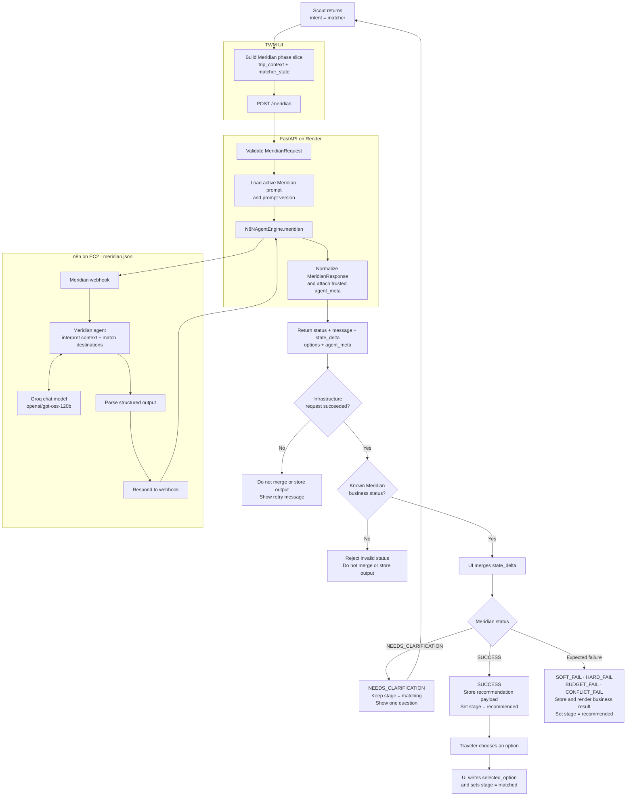

# Trip Matcher

Trip Matcher helps a traveler move from open-ended trip context to a confident destination or circuit decision. Meridian is the agent that owns matcher conversation, clarification, ranking, and the visible matcher response.

Scout is the product-wide conversational router. When Scout returns `intent = matcher`, the UI invokes Meridian automatically in the same chat turn. See the [overall TWM flow](../README.md) for Scout and cross-capability routing.

## Current Scope

Trip Matcher currently:

- interprets open-ended `trip_context` without requiring a fixed form;
- uses `matcher_state` for clarification and recommendation continuity;
- asks at most one useful clarification when an answer would materially change the recommendation;
- returns up to three ranked destination or circuit options when useful;
- explains important matches and tradeoffs;
- returns expected business-failure outcomes when constraints prevent a clean recommendation.

## Request Flow

For Meridian's context evaluation, clarification, ranking, and failure-classification logic, see the [internal decision flow](MERIDIAN.md#internal-decision-flow).

## Ownership

| Owner | Responsibilities |
| --- | --- |
| Meridian | Interpret matcher context, ask a clarification or produce ranked options, explain matches and tradeoffs, and return `message` plus `state_delta`. |
| Backend | Validate the request and response contract, load the released prompt, forward execution to the configured agent engine, normalize the response, and attach trusted prompt provenance. |
| UI | Send only the Meridian phase slice, merge returned deltas, store recommendation history, render outcomes, own lifecycle stage transitions, and write deterministic option selection. |

Meridian does not write `stage` or `trip_context.selected_option`. The UI owns both lifecycle progression and the traveler's final selection.

## Outcome Handling

| Status | UI behavior |
| --- | --- |
| `NEEDS_CLARIFICATION` | Show Meridian's single question and keep the trip in `matching`. |
| `SUCCESS` | Store the response as recommendation history, set `recommended`, and render the option cards. |
| `SOFT_FAIL`, `HARD_FAIL`, `BUDGET_FAIL`, `CONFLICT_FAIL` | Treat as expected business output, store the result, set `recommended`, and render the explanation and any relaxation suggestions. |
| Infrastructure or invalid-status error | Do not append recommendation history; show a retryable error. |

When the traveler selects a destination or circuit, the UI writes `trip_context.selected_option` and sets the lifecycle stage to `matched`.

## Related Documentation

- [Overall TWM flow](../README.md)
- [Meridian behavior and internal decision flow](MERIDIAN.md#internal-decision-flow)
- [Trip Matcher API contracts](API_CONTRACTS.md)
- [TripState](../TRIP_STATE.md)
- [Lifecycle stage transitions](../STAGE_TRANSITIONS.md)
- [Architecture](../ARCHITECTURE.md)
