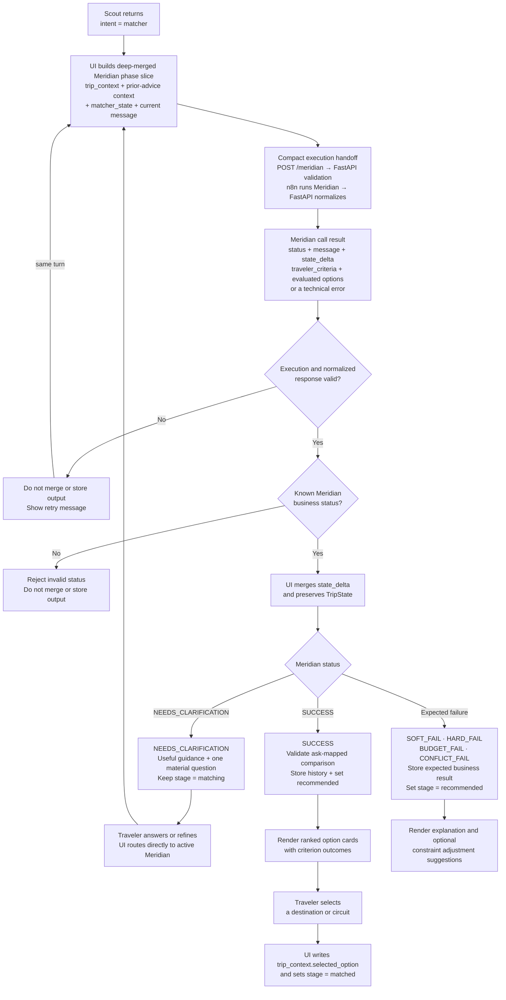

# Trip Matcher

Trip Matcher helps a traveler move from open-ended trip context to a confident destination or circuit decision. Meridian is the agent that owns matcher conversation, clarification, ranking, and the visible matcher response.

Scout performs entry routing. When Scout returns `intent = matcher`, the UI invokes Meridian automatically in the same chat turn. From that handoff onward, Meridian owns clarification and refinement; the UI sends later matching turns directly to Meridian. See the [overall TWM flow](../README.md) for cross-capability routing.

## Current Scope

Trip Matcher currently:

- interprets open-ended `trip_context` without requiring a fixed form;
- uses `matcher_state` for clarification and recommendation continuity;
- addresses the current matching ask from known context before asking for anything else;
- asks exactly one material clarification when an answer would materially change feasibility, ranking, or the recommendation;
- recommends after the traveler answers when the context is ready;
- returns up to three ranked destination or circuit options when useful;
- accounts for material traveler constraints, assumptions, matches, mismatches, trade-offs, and circuit feasibility;
- returns expected business-failure outcomes when constraints prevent a clean recommendation.

## Request Flow



The execution handoff is intentionally compact: FastAPI validates and normalizes the contract, while n8n executes Meridian. `NEEDS_CLARIFICATION` keeps Meridian active. A terminal business outcome clears the active specialist and returns lifecycle control to the UI.

For Meridian's context evaluation, clarification, ranking, and failure-classification logic, see the [internal decision flow](MERIDIAN.md#internal-decision-flow).

## Ownership

| Owner | Responsibilities |
| --- | --- |
| Meridian | Interpret matcher context, own clarification/refinement until a terminal outcome, define traveler criteria once, and evaluate every option against every criterion. |
| Backend | Validate the request and response contract, load the released prompt, forward execution to the configured agent engine, normalize the response, and attach trusted prompt provenance. |
| UI | Dispatch every turn to the active owner, validate terminal recommendation references before state mutation, render the ask-mapped comparison, and own history, stage, retry, resume, refinement, navigation, and selection. |

Meridian does not write `stage` or `trip_context.selected_option`. The UI owns both lifecycle progression and the traveler's final selection.

## Outcome Handling

| Status | UI behavior |
| --- | --- |
| `NEEDS_CLARIFICATION` | Show Meridian's single question and keep the trip in `matching`. |
| `SUCCESS` | Store the response as recommendation history, set `recommended`, and render the option cards. |
| `SOFT_FAIL`, `HARD_FAIL`, `BUDGET_FAIL`, `CONFLICT_FAIL` | Treat as a terminal business output, store the result, set `recommended`, clear the active specialist, and render the explanation and optional `constraint_adjustment_suggestions`. |
| Infrastructure or invalid-status error | Keep the active owner and valid state, do not append recommendation history, and offer retry for the same turn. |

## Recommendation review experience

The response `message` introduces the ranking. The UI renders up to three compact ranked cards using only response-level `traveler_criteria` and the corresponding per-option `evaluations`. Each card shows the option summary and the `MATCH`, `TRADEOFF`, or `MISMATCH` conclusion for every criterion. Rank and outcomes establish the strongest match; there is no separate option verdict.

Opening **Why this works for you** keeps the comparison visible and expands one full-width panel. The panel renders only approved bullets, facts, and valid cost breakdowns. Criterion-specific trade-offs stay beside that criterion; residual `other_considerations` appear under **Things to consider**. Missing cost estimates are omitted rather than displayed as zero.

Selection is a deterministic UI write to `trip_context.selected_option` and moves the trip to `matched`. Refinement returns ownership to Meridian with persisted TripState. Refresh and resume restore the stored recommendation history, selection, lifecycle stage, provenance, and expanded recommendation state. After selection, the Planner action is UI-owned; Meridian never embeds an itinerary in destination recommendations.

## Continuation Example

```text
Traveler asks for destination options
  -> UI calls Scout because Scout owns entry
  -> Scout returns intent = matcher plus trip_context delta
  -> UI merges the delta and calls Meridian with the same message
  -> Meridian addresses the current ask from known context, asks one material question, and sets awaiting
  -> traveler answers briefly
  -> UI calls Meridian directly with current TripState and the new message
  -> Meridian preserves the useful answer and recommends when ready
```

When the traveler selects a destination or circuit, the UI writes `trip_context.selected_option` and sets the lifecycle stage to `matched`.

## Related Documentation

- [Overall TWM flow](../README.md)
- [Meridian behavior and internal decision flow](MERIDIAN.md#internal-decision-flow)
- [Trip Matcher API contracts](API_CONTRACTS.md)
- [TripState](../TRIP_STATE.md)
- [Lifecycle stage transitions](../STAGE_TRANSITIONS.md)
- [Architecture](../ARCHITECTURE.md)
